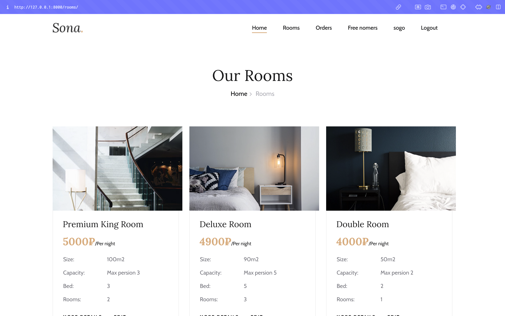
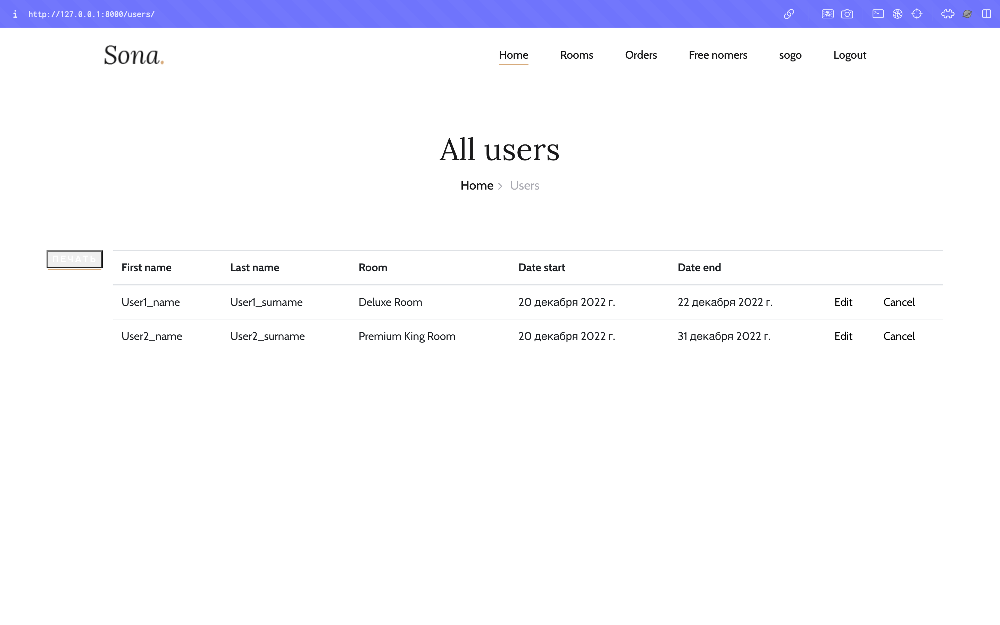
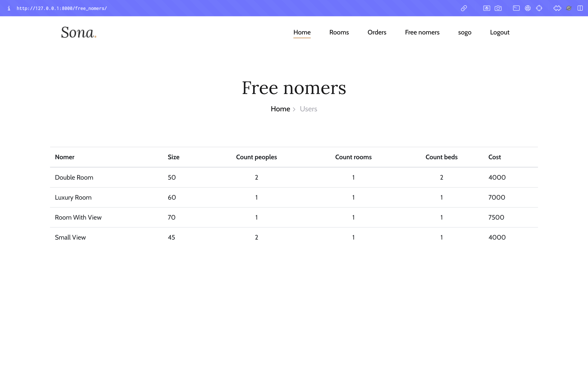

## Описание варианта

Вариант 19: Разработка информационной системы Учёт номеров в 
гостинице

Система должна обеспечивать ввод, изменение, удаление и вывод 
информации о номерах гостиницы, их параметрах, о бронировании и 
занятости номеров, о клиентах гостиницы. Необходимо предусмотреть 
хранение и отображение фотографий. Система должна иметь 3 типа 
пользователей: «Администратор», «Оператор» и «Клиент». Клиент может 
выбрать номер и забронировать его на определённую дату. Информация о 
номерах должна сопровождаться фотографией номера. Должны 
генерироваться отчёты со списком доступных номеров (и их параметров) на 
определённые даты и прочие отчёты.

- Пользователь с ролью «Администратор» может создавать 
пользователей с типом «Оператор», редактировать и удалять всех 
пользователей. Ему доступен весь функционал.
- Пользователь с ролью «Оператор» может редактировать информацию о 
номерах.
- Клиент может просматривать информацию о номерах, бронировать их, 
регистрируясь в системе.

## Некоторые скриншоты

