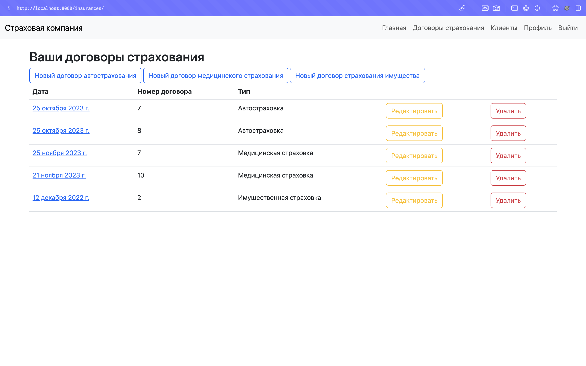
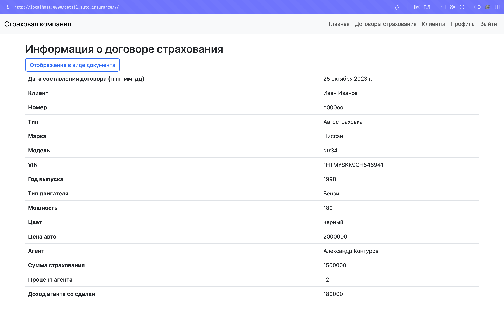
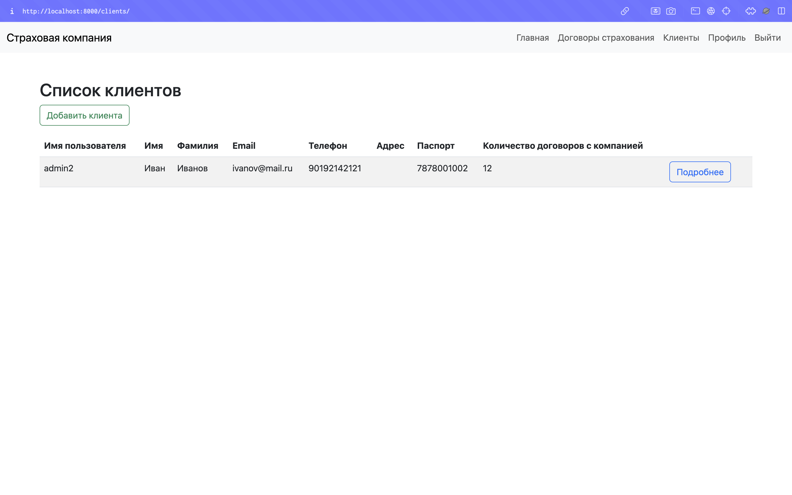
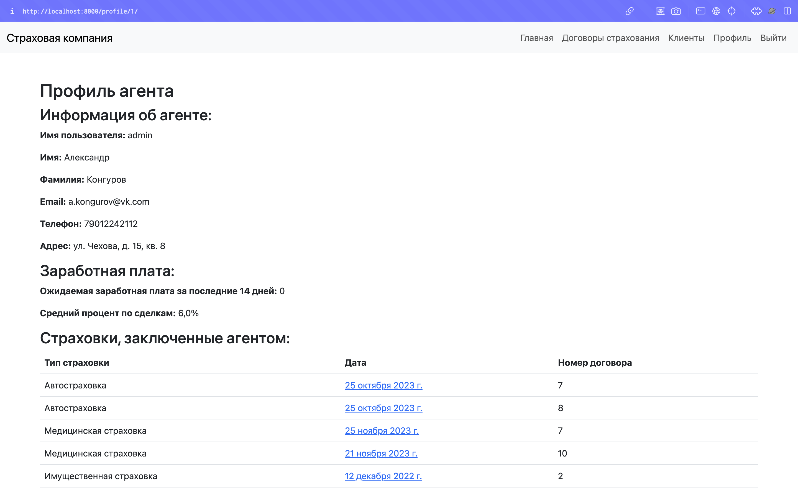
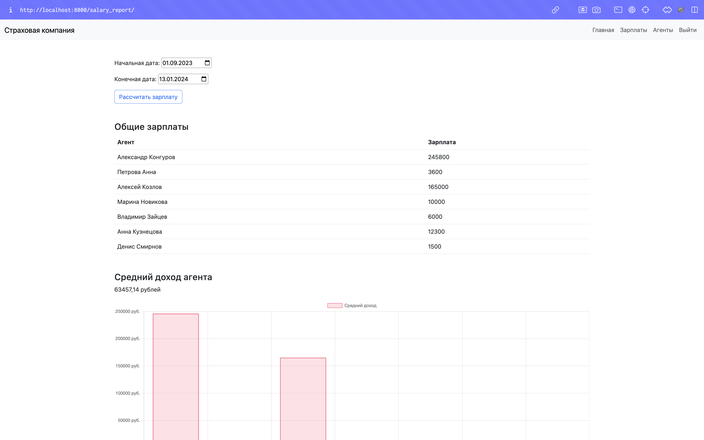

## Описание варианта

Вариант 2: Разработка информационной системы для страховой компании

Задачей информационной системы является отслеживание финансовой деятельности компании.
Компания имеет различные филиалы по всей стране.

Каждый филиал 
характеризуется названием, адресом и телефоном. Деятельность компании 
организована следующим образом: к Вам обращаются различные лица с 
целью заключения договора о страховании.

В зависимости от принимаемых на страхование объектов и страхуемых 
рисков, договор заключается по определенному виду страхования (например, 
страхование автотранспорта от угона, страхование домашнего имущества, 
добровольное медицинское страхование). При заключении договора Вы 
фиксируете дату заключения, страховую сумму, вид страхования, тарифную 
ставку и филиал, в котором заключался договор.

Нужно учесть, что договоры заключают страховые агенты. Помимо 
информации об агентах (фамилия, имя, отчество, адрес, телефон), нужно еще 
хранить информацию о филиале, в котором работают агенты.

Кроме того, нужно иметь возможность рассчитывать заработную плату 
агентам. Заработная плата составляет некоторый процент от страхового 
платежа (страховой платеж — это страховая сумма, умноженная на 
тарифную ставку). Процент зависит от вида страхования, по которому 
заключен договор.

Роли:
- Администратор имеет полный набор прав. 
- Агент имеет право на добавление или изменение договора, добавление 
или изменение информации о клиенте, просматривать текущую зарплату, 
информацию о филиалах и сотрудниках.
- Бухгалтер имеет право работать с начислением заработной платы 
(добавлять, редактировать, удалять записи), просматривать информацию о 
филиалах и сотрудниках).

## Некоторые скриншоты

