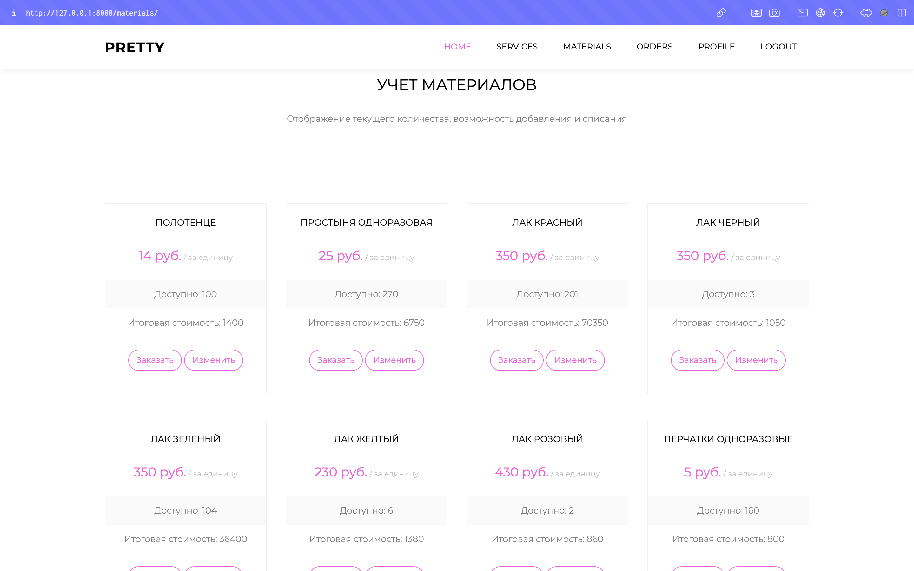
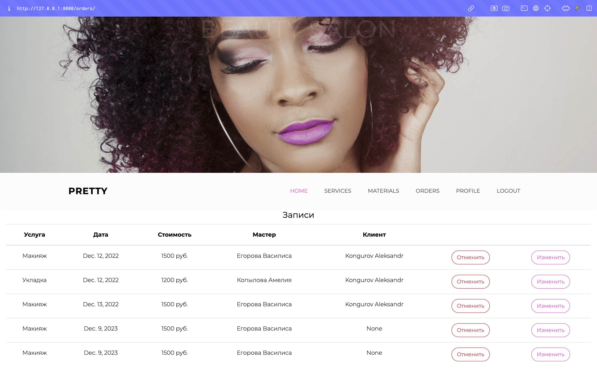

## Описание варианта

Вариант 29: Разработка информационной системы для Салон красоты
В приложении необходимо наличие функционала, позволяющего принимать и 
обрабатывать заказы, управлять списком мастеров и назначать им задачи 
(заказы), вести учёт расходных материалов.
Заказы должны иметь определённые атрибуты, например:
- дату;
- описание;
- тип услуги и т.д.
Заказы можно будет отменять и переносить.

- В приложении также должна быть роль «Управляющий», который контролирует 
выполнение заказов, осуществляет списание и закупку новых материалов. Он 
также может переносить заказы и изменять их данные.
Необходимо также хранить фотографии сотрудников салона.

## Некоторые скриншоты

